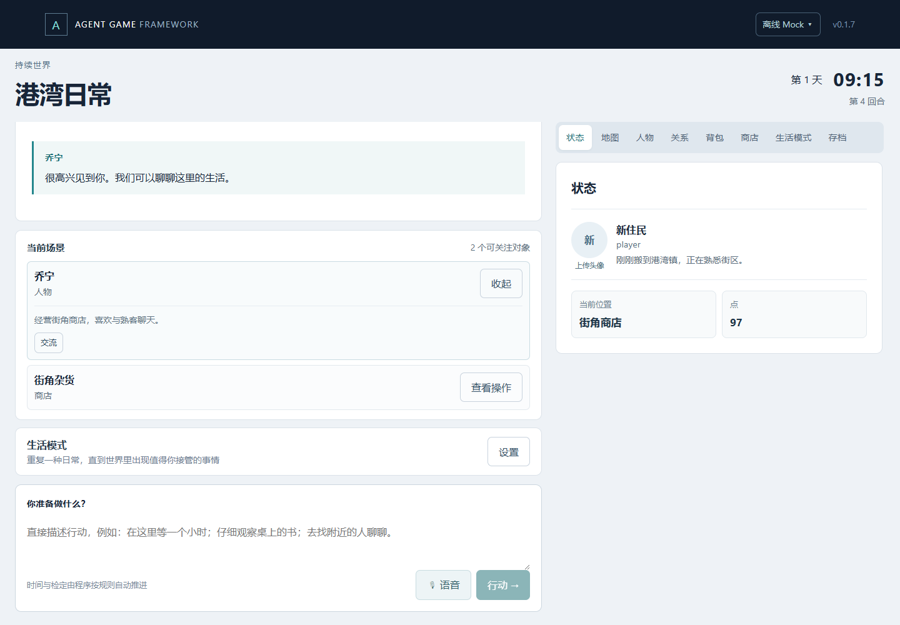

# Agent Game Framework

An extensible AI-native persistent-world game framework.

**AI proposes / interprets. Framework validates and executes. Save state determines reality.**

A local TypeScript runtime and browser interface for worlds whose facts persist across turns, reloads, and model changes. Current application version: **0.1.7**. The player-facing UI is primarily Chinese.



*Screenshot uses only the bundled fictional example; no private save or uploaded portrait.*

## Features

- Entity/component storage and lightweight module, action, schema, and event registries.
- Deterministic movement, time, dice, inventory, commerce, and equipment.
- Structured relationships, attributes, aptitudes, skills, traits, and quests.
- Hierarchical maps, known/hidden locations, and controlled map discovery.
- Routine/time compression with event-driven interruption.
- Versioned Prompt Profiles and interchangeable AI adapters.
- Autosave, manual checkpoint, JSON World/Save import and export.
- Local player/NPC avatar upload; optional browser speech-to-text.

## Architecture

```text
Web UI → GameService → Action / Module Runtime → Validated canonical Save
                ↕
           AI Runtime → AIAdapter → Codex / OpenAI / DeepSeek / Compatible / Mock
```

A model can propose an action or a permitted patch. It cannot directly merge arbitrary JSON into the save. Registered handlers execute mechanical changes and validation controls acceptance. A Codex thread is replaceable context, **not** the world database.

See [architecture](docs/ARCHITECTURE.md) and [extension guide](docs/EXTENDING.md).

## Quick start (no AI account required)

Requires **Node.js 22.12+** and npm. Run these commands in the repository directory:

```sh
npm ci
npm run build
```

PowerShell:

```powershell
$env:AI_ADAPTER = "mock"
npm start
```

macOS / Linux shell:

```sh
AI_ADAPTER=mock npm start
```

Open [localhost:3100](http://127.0.0.1:3100). Choose **导入 JSON** and select [content/worlds/town.json](content/worlds/town.json). This public example has three locations, two NPCs, a shop, and three items. Use the map, scene actions, and shop to explore it.

Mock executes program rules and supplies placeholder dialogue; it does not interpret arbitrary text or create AI worlds. Select a real provider for those features. The app opens a launcher, not an existing private game automatically.

The server binds only to loopback. This is a local application, not an internet deployment.

### Environment file

[.env.example](.env.example) lists the actual supported settings with empty key fields. Copy it to `.env`, then explicitly load it with Node:

```sh
node --env-file=.env dist/server/server/index.js
```

`npm start` alone does **not** load `.env`. Alternatively, set environment variables in the shell. Never commit the filled file.

## Supported AI providers

| Mode | Adapter | Configuration |
|---|---|---|
| Local/subscription | Codex | Local CLI and ChatGPT/Codex login; no OpenAI API key |
| API | OpenAI | Your API key; Responses API with JSON Schema |
| API | DeepSeek | Your API key; this implementation targets `/responses` |
| API | Responses-compatible | Your base URL, model, and key via the provider dialog |
| Offline | Mock | No credentials or model network calls |

These are implemented adapter contracts, not a promise that every account, model, or “OpenAI-compatible” endpoint supports them. Release checks use Mock; they do not certify live API availability.

API keys supplied through the UI are sent to the local Node server and kept in process memory, not Save Packages or browser storage. Environment keys remain in your own process environment. Use trusted provider URLs.

### Codex subscription mode

```powershell
codex login
codex login status
$env:AI_ADAPTER = "codex"
npm start
```

Uses your local Codex login and your own Codex usage limits. It does not require an OpenAI API key; API-provider billing is separate. The project pins `@openai/codex-sdk@0.156.0`. `CODEX_PATH` can select a compatible native CLI executable; `CODEX_MODEL` selects an account-accessible model. See [provider setup](docs/AI_PROVIDERS.md) for API modes, defaults, proxies, and compatibility limits.

## Creating a world

Choose **创建新世界**, describe the setting and player, and optionally import a text/Markdown policy or JSON Prompt Profile. WorldInitializer returns a structured blueprint; the framework compiles and validates it before accepting a new canonical save.

The current authoring schema permits 4–16 locations, 1–5 NPCs, and a small shop/item set. Hand-authored World Packages can use the broader runtime schema; the three-location public example is intentional.

To use another initial template, set `GAME_WORLD_FILE`. `PROMPT_PROFILE_PATH` overrides the default profile for AI-created worlds. No private game is required.

## Saves and canonical state

Every committed action autosaves. **存档** provides one manual checkpoint, restore, and JSON import/export. The launcher also accepts World Packages. Import validates schemas, required modules, versions, and references before replacing state.

Exports contain canonical world data, rules, Prompt Profile, and **GM-hidden information**. They are personal backups, not safe public bug-report attachments. Thread caches are cleared for portability. Avatar IDs are exported, but uploaded image bytes are **not** bundled.

Application version `0.1.7` is distinct from the retained save contract (`schema_version: 1`, `framework_version: "0.1.0"`). This release preparation does not change that contract. The existing automatic routine upgrade for older saves remains in place.

## Modules and Prompt Profiles

Built-in modules: core, characters, relationships, inventory, commerce, attributes, aptitudes, skills, traits, equipment, quests, routine.

Modules register component schemas, action handlers, validators, hooks, panel metadata, and optional AI prompt/patch capabilities. Add systems through these interfaces rather than adding game-specific branches to Core. [Real extension examples](docs/EXTENDING.md) include the existing Company/HIRE test.

Profiles contain `id`, `version`, `engine_policy`, `world_initializer`, `intent_interpreter`, `narrator`, `npc_decision`, and `gm_reasoning`. The last two are reserved roles, not active autonomous agents. See [the generic default](content/profiles/default.json).

## Project structure

```text
src/core/        state, schemas, registries, actions, events, map, time, dice
src/modules/     gameplay modules
src/ai/          role contracts, profiles, provider manager and adapters
src/storage/     JSON persistence
src/server/      HTTP boundary and GameService
src/client/      React UI and panel registry
src/shared/      public contracts
content/         public example world and generic profile
tests/           offline regression tests
scripts/         smoke tests and public-file audit
docs/            architecture, providers, extensions, release notes
data/            ignored private saves, avatars and runtime output
imports/         ignored personal migration inputs
```

## Development commands

| Command | Purpose |
|---|---|
| `npm ci` / `npm install` | Locked install / dependency installation |
| `npm run dev` | Node watcher + Vite at localhost:5173 |
| `npm run typecheck` | TypeScript validation without emitting files |
| `npm test` | Offline unit/integration tests |
| `npm run build` | Typecheck, frontend bundle, server compilation |
| `npm start` | Run the production build |
| `npm run smoke` | Mock demo, HTTP health, actions, saves and process restart |
| `npm run audit:public` | Check proposed public files and Git objects for common risks |
| `npm run smoke:browser` | Optional desktop UI test; requires Playwright Chromium |
| `npm run smoke:codex` | Optional paid/quota-consuming live Codex test |

Do not run live provider tests just to validate a documentation change. [Release validation](docs/RELEASE_CHECKLIST.md) records actual results and remaining publication gates.

## Known limitations

- Single local player, one active save and checkpoint; no hosted multiplayer.
- No full combat/company simulation or continuously running background NPC agents.
- Routine compresses time; task-specific earnings/XP require corresponding modules.
- AI narration may be inconsistent despite valid JSON; schema validation is not semantic proof.
- Provider endpoints/models may change. Responses-compatible does not mean arbitrary Chat Completions support.
- A hard-killed process can leave `runtime.lock`; verify the old process is gone before removing it.
- JSON exports do not bundle avatars; image upload validates size/type signatures, not a full content-decoding pipeline.
- Codex tool restrictions and result checks are defense in depth, not a guarantee of pure inference isolation.

## Roadmap

1. Broader offline provider-contract and save-migration regression coverage.
2. Longer-session narrative/state consistency evaluations.
3. Portable save bundles including local visual assets.
4. Better authoring/profile editing and validation feedback.
5. New gameplay modules with deterministic rules and explicit AI capabilities.

## Security, privacy and licensing

Private saves, migration files, uploads, credentials, logs and test artifacts are excluded from Git. Only the fictional example world is public. Do not attach a real save, private profile or environment file to an issue. Review staged files and history before any push; pattern scanning cannot prove the absence of all secrets. See [security notes](SECURITY.md).

**A license has not yet been selected.** This source is not yet offered under an open-source license. Choose a license before announcing an open-source release.
